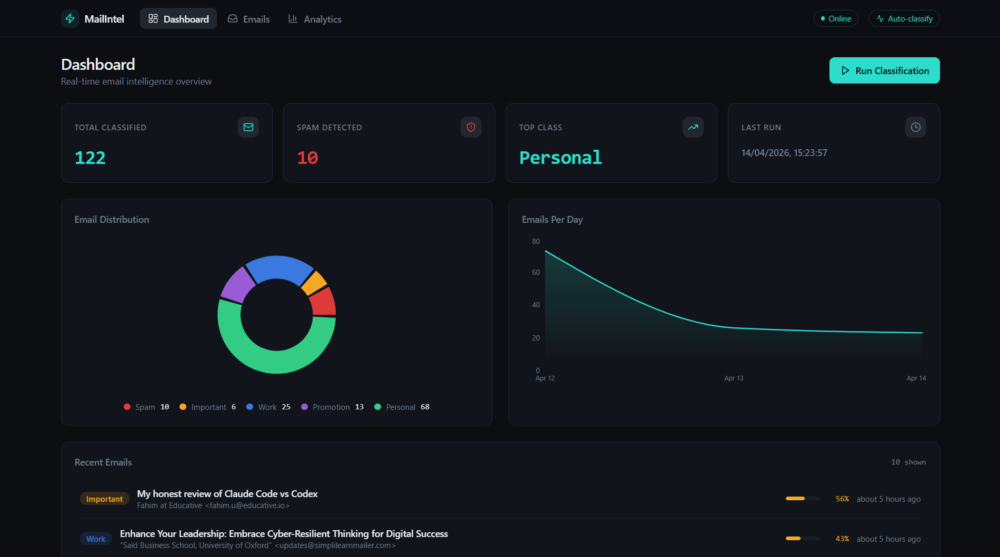

<div align="center">


<br/>

[](https://www.python.org/)
[](https://www.tensorflow.org/)
[](https://keras.io/)
[](https://scikit-learn.org/)
[](https://www.nltk.org/)
[](https://pandas.pydata.org/)
[](https://numpy.org/)
[](https://plotly.com/)
[](https://jupyter.org/)

<br/>

[](https://colab.research.google.com/github/YOUR_USERNAME/YOUR_REPO/blob/main/emails_classification.ipynb)
&nbsp;

&nbsp;

&nbsp;

&nbsp;


</div>

---



---

## Table of Contents

- [Overview](#overview)
- [Privacy Notice](#privacy-notice)
- [Results](#results)
- [Visualisations and Interpretation](#visualisations-and-interpretation)
  - [Label Distribution](#label-distribution)
  - [Word Cloud](#word-cloud)
  - [Top-30 Most Frequent Terms](#top-30-most-frequent-terms)
  - [Confusion Matrix - Naive Bayes](#confusion-matrix---naive-bayes)
  - [Confusion Matrix - SVM](#confusion-matrix---svm)
  - [Confusion Matrix - LSTM](#confusion-matrix---lstm)
  - [Model Comparison Chart](#model-comparison-chart)
- [Full Pipeline Architecture](#full-pipeline-architecture)
- [Dataset](#dataset)
- [Text Cleaning Pipeline](#text-cleaning-pipeline)
- [NLP Preprocessing](#nlp-preprocessing)
- [Rule-Based Labelling](#rule-based-labelling)
- [Feature Engineering - TF-IDF](#feature-engineering---tf-idf)
- [Models](#models)
  - [Naive Bayes](#naive-bayes)
  - [SVM Linear Kernel](#svm-linear-kernel)
  - [LSTM Deep Learning](#lstm-deep-learning)
- [Model Comparison and Analysis](#model-comparison-and-analysis)
- [Key Technical Decisions](#key-technical-decisions)
- [Tech Stack](#tech-stack)
- [Repository Structure](#repository-structure)
- [Quickstart](#quickstart)
- [Skills Demonstrated](#skills-demonstrated)
- [Contributing](#contributing)
- [Contact](#contact)

---

## Overview

This project builds a complete, production-style email classification system from the ground up. Starting with raw, unstructured inbox data, the pipeline covers every step a real NLP engineer would implement:

- **Robust data ingestion** — handles malformed CSVs with embedded newlines and oversized fields that break standard pandas parsing
- **Multi-step text cleaning** — 13-stage deterministic pipeline removing HTML, URLs, email addresses, numbers, punctuation, and normalising Unicode
- **NLP preprocessing** — tokenisation, stop-word removal, and lemmatisation using NLTK
- **Automatic rule-based labelling** — keyword-driven category assignment with explicit priority ordering
- **Feature engineering** — TF-IDF vectorisation for classical models; integer-sequence padding for deep learning
- **Three model comparison** — Naive Bayes, SVM, and LSTM trained and evaluated under identical conditions
- **Professional evaluation** — accuracy, precision, recall, F1-score (weighted), and confusion matrices for all three models

The project is structured so that anyone can reproduce the full pipeline from scratch with their own raw email data, or jump straight to modelling using the pre-processed `emails_final.csv`.

---

## Privacy Notice

The original raw dataset (`emails_extracted.csv`) consists of **personal emails from a real inbox** and is not included in this repository for privacy and safety reasons.

- Sections 2, 3, and 4 of the notebook contain the full cleaning and preprocessing pipeline, all commented out, so the methodology is completely transparent and reproducible.
- All modelling and visualisations run on `emails_final.csv`, which contains only anonymised, token-level data — no raw email content, no sender information, no message bodies.
- If you want to run this pipeline on your own email data, export your inbox to CSV, update the file path in Section 2, and uncomment those cells.

---

## Results

### Model Performance Summary

| Model | Accuracy | Precision (W) | Recall (W) | F1-Score (W) |
|:------|:--------:|:-------------:|:----------:|:------------:|
| Naive Bayes | 72.6% | 73.9% | 72.6% | 72.1% |
| SVM — Linear Kernel | 79.5% | 80.5% | 79.5% | 78.9% |
| **LSTM (Deep Learning)** | **81.0%** | **81.3%** | **81.0%** | **81.1%** |

*(W) = Weighted average across all 5 classes, accounting for class imbalance*

### Key Takeaways

- **LSTM is the best model** across all four metrics
- **SVM is the best classical model** — strong performer with much faster training than LSTM and no GPU required
- **Naive Bayes is a solid baseline** — trains in milliseconds and still achieves 72.6% accuracy
- The gap from Naive Bayes to SVM (~7%) is larger than SVM to LSTM (~1.5%), which tells an important story: TF-IDF bag-of-words features alone capture the majority of the classification signal. The LSTM's marginal gain comes from sequential context awareness.
- All three models were evaluated on the same held-out 20% test set with the same stratified split, so the comparison is fair.

---

## Visualisations and Interpretation

### Label Distribution

<div align="center">

</div>

**What the chart shows:**
The bar chart displays how many emails fall into each of the five categories after rule-based labelling was applied. Each bar is a different colour and represents one category.

**Interpretation:**
The distribution is noticeably uneven, which reflects reality — a real inbox is not balanced across categories. Promotion and Personal emails tend to dominate because marketing emails and general correspondence are the most common types of email in a typical inbox. Work-related emails form a meaningful but smaller proportion. Important and Spam emails are relatively rare in absolute terms, though Spam is critical to catch correctly.

This imbalance has a direct impact on model training and evaluation. A naive model that simply predicted "Promotion" for every email could achieve high accuracy purely by exploiting this skew. This is exactly why weighted F1-score is reported alongside accuracy — weighted F1 penalises a model that ignores minority classes. It is also why `stratify=y` was used in the train/test split, so each category's proportion is preserved in both the training and test sets.

---

### Word Cloud

<div align="center">

</div>

**What the chart shows:**
A word cloud where the size of each word is proportional to how frequently it appears across all email body tokens after NLP preprocessing. Larger words appear more often; smaller words are less common.

**Interpretation:**
Prominent words like **data**, **ai**, **learn**, **email**, **company**, **science**, and **job** dominate the corpus. This reveals that the dataset is heavily skewed toward professional, tech-related, and career-focused emails — newsletters from data science platforms, job alerts, LinkedIn messages, and AI/ML promotional content.

Several observations stand out:

- The prevalence of **ai**, **model**, **python**, and **data** suggests a large number of tech newsletter and course promotion emails.
- Words like **job**, **apply**, **alert**, **career** indicate significant job alert and recruitment email volume.
- **Email**, **unsubscribe**, and **click** are common in promotional/marketing emails, which aligns with the large Promotion category in the label distribution.
- Notably absent are words strongly associated with personal conversation (family names, casual greetings), confirming that Personal emails are relatively sparse or use more diverse vocabulary that spreads thin across the word cloud.

The word cloud is useful for confirming that preprocessing worked correctly — no HTML tags, URLs, numbers, or stop-words are visible, meaning the cleaning pipeline ran as intended.

---

### Top-30 Most Frequent Terms

<div align="center">

</div>

**What the chart shows:**
A bar chart of the 30 most frequently occurring tokens across all email bodies, plotted in descending order of frequency. The y-axis shows raw count; the x-axis shows the token.

**Interpretation:**
The frequency chart confirms and extends what the word cloud showed, but with precise counts attached.

The most frequent terms fall into clear clusters:

- **General tech/AI terms** (data, ai, learn, model, python, science, email) — appear thousands of times, confirming that the inbox contains a high volume of data science newsletters and course promotion emails.
- **Action words in promotional context** (get, use, build, make, help, work, need) — these are the staple vocabulary of marketing copy, consistent with the large Promotion category.
- **Platform/professional terms** (job, company, business, team) — point toward work emails and LinkedIn notifications.

An important takeaway for modelling: the most frequent terms are shared across multiple categories. "Data" appears in Work emails, Promotion emails, and Important emails alike. This means frequency alone is a weak signal — the model needs to look at combinations of tokens and their relative rarity within each category, which is exactly what TF-IDF is designed to capture. Words that are common globally but rare within specific categories get low TF-IDF scores; words that are distinctive to one category get high scores.

This chart also validates that lemmatisation worked: "learning" and "learn" are consolidated, "companies" and "company" are merged, which prevents the vocabulary from fragmenting on morphological variants.

---

### Confusion Matrix - Naive Bayes

<div align="center">

</div>

**How to read a confusion matrix:**
Rows represent the actual (true) category. Columns represent what the model predicted. The ideal model has all counts on the main diagonal — top-left to bottom-right — with zero counts everywhere else. Any number off the diagonal is a misclassification. Darker shading means more emails landed in that cell.

**Interpretation of the Naive Bayes matrix:**

The Naive Bayes matrix shows the weakest diagonal of the three models, reflecting its lowest F1-score of 72.1%.

The most visible off-diagonal concentrations reveal where Naive Bayes struggles:

- **Promotion vs Personal confusion** — a notable number of Personal emails are predicted as Promotion and vice versa. This makes intuitive sense: both categories share overlapping vocabulary (greetings, names, social language). Naive Bayes cannot distinguish these based on token co-occurrence patterns because it treats each token independently — it sees "congratulations" and "offer" in the same email and cannot determine which is dominant in context.
- **Work vs Important confusion** — emails about urgent deadlines, contracts, or payments sit at the boundary of Work and Important. Naive Bayes frequently misclassifies these because words like "deadline", "payment", and "meeting" appear in both categories with similar probability distributions.
- **Spam detection** — Spam has a relatively strong diagonal compared to other off-diagonal misclassifications. This is expected: Spam keywords like "bitcoin", "lottery", and "win money" are highly distinctive and rarely appear in other categories, making them easy to detect even with a simple probabilistic model.

The overall pattern shows that Naive Bayes works well for categories with highly distinctive vocabulary (Spam) but struggles with semantically similar categories where word choice overlaps.

---

### Confusion Matrix - SVM

<div align="center">

</div>

**Interpretation of the SVM matrix:**

The SVM matrix shows a noticeably cleaner diagonal than Naive Bayes, matching its improved F1-score of 78.9%. The green colormap makes this visually clear — the diagonal cells are darker and the off-diagonal cells lighter compared to the Naive Bayes matrix.

Key observations:

- **Promotion and Personal separation improves significantly** — SVM's ability to find a maximum-margin hyperplane in 5,000-dimensional TF-IDF space allows it to draw a more precise boundary between these categories, even when individual tokens overlap.
- **Work vs Important still causes some confusion** — this is the most persistent misclassification across all three models. The content is genuinely ambiguous: an urgent project deadline email could legitimately belong to either category depending on framing.
- **Spam performance is similarly strong** — like Naive Bayes, SVM easily identifies Spam because the Spam keywords form a tight, well-separated cluster in TF-IDF space.
- **Fewer total off-diagonal errors** — the sum of all off-diagonal cells is meaningfully smaller than in the Naive Bayes matrix, which is directly reflected in the ~7% accuracy improvement.

The SVM matrix demonstrates that a linear decision boundary in high-dimensional space is a powerful approach for multi-class text classification, especially when categories have distinctly different vocabulary profiles.

---

### Confusion Matrix - LSTM

<div align="center">

</div>

**Interpretation of the LSTM matrix:**

The LSTM matrix has the darkest diagonal and lightest off-diagonal cells of all three models, confirming its position as the best-performing model with an 81.1% weighted F1-score.

Key observations:

- **Work vs Important confusion is reduced further** — the LSTM's ability to consider token sequences rather than just individual token frequencies allows it to pick up on contextual patterns. An email that says "the payment is due at the end of the project" reads differently from "the payment is urgently due" — a sequential model can capture this nuance that bag-of-words cannot.
- **Promotion and Personal are well-separated** — the learned word embeddings group semantically similar words together in vector space. This means the model can recognise that "exclusive offer", "limited time", and "discount code" belong together as Promotion language, even if individual tokens appear elsewhere.
- **Spam remains the easiest category** — all three models handle Spam well, but the LSTM is the most consistent.
- **The improvement over SVM is modest but real** — the LSTM gains approximately 1.5% in accuracy over SVM. This suggests the dataset is not complex enough to show a dramatic deep learning advantage — with 5,000 emails, the LSTM does not have enough data to fully exploit its representational capacity. On a larger dataset, the gap would likely be wider.

Overall, the LSTM confusion matrix demonstrates that sequential context awareness adds measurable value for categories where word order and phrase-level meaning matter — particularly Work, Important, and the boundary between the two.

---

### Model Comparison Chart

<div align="center">

</div>

**What the chart shows:**
A grouped bar chart where each group represents one model (Naive Bayes, SVM, LSTM) and each bar within a group represents one metric (Accuracy, Precision, Recall, F1-Score). All metrics are on a 0–1 scale.

**Interpretation:**

The chart makes three things immediately clear:

1. **All four metrics move together for each model** — Accuracy, Precision, Recall, and F1 are tightly clustered within each model group. This indicates the models are not trading off precision against recall in a skewed way. A model that achieves high precision at the cost of low recall (or vice versa) would show large gaps between its bars. The tight grouping here means each model is performing in a balanced, well-calibrated way across all categories.

2. **The ranking is consistent** — LSTM > SVM > Naive Bayes on every single metric without exception. This consistency is reassuring; it means the performance differences are genuine and not artefacts of one metric being more favourable to a particular model.

3. **The absolute improvement from SVM to LSTM is smaller than the improvement from Naive Bayes to SVM** — visually, the height difference between the SVM and LSTM bar groups is smaller than between the Naive Bayes and SVM groups. This is the key diagnostic for interpreting the results: it tells us that the feature representation (TF-IDF) explains more of the classification difficulty than the model architecture does. Switching from a probabilistic classifier to a margin-based one gives a bigger gain than switching from a classical model to a deep learning model — which means the problem is well-suited to classical ML at this dataset size.

---

## Full Pipeline Architecture

```
+======================================================================+
|                         RAW EMAIL INBOX                              |
|                     (emails_extracted.csv)                           |
|                                                                      |
|   Columns : id | from | subject | snippet | body                     |
|   Rows    : ~5,000 emails                                            |
|   Issues  : embedded newlines, oversized fields, HTML, emojis,       |
|             URLs, encoding artefacts, missing values                  |
|                                                                      |
|   NOT INCLUDED -- personal emails, excluded for privacy              |
+===================================+==================================+
                                    |
                      +-------------v-------------+
                      |          STEP 1           |
                      |        CSV PARSER         |
                      |                           |
                      |  csv.field_size_limit()   |
                      |  line-by-line reading     |
                      |  skip malformed rows      |
                      |  enforce 5-column schema  |
                      +-------------+-------------+
                                    |
                      +-------------v-------------+
                      |          STEP 2           |
                      |       TEXT CLEANING       |
                      |      (clean_text fn)      |
                      |                           |
                      |  NFKC Unicode normalise   |
                      |  fix line-break splits    |
                      |  lowercase                |
                      |  strip HTML (BS4)         |
                      |  expand contractions      |
                      |  remove URLs              |
                      |  remove email addresses   |
                      |  remove numbers           |
                      |  remove punctuation       |
                      |  collapse whitespace      |
                      |  fill NaN -> no_content   |
                      +-------------+-------------+
                                    |
                      +-------------v-------------+
                      |          STEP 3           |
                      |    NLP PREPROCESSING      |
                      |    (process_text fn)      |
                      |                           |
                      |  strip residual HTML      |
                      |  remove emojis            |
                      |  remove punctuation       |
                      |  tokenise (NLTK)          |
                      |  remove stop-words        |
                      |  remove single chars      |
                      |  lemmatise (WordNet)      |
                      |                           |
                      |  -> subject_tokens        |
                      |  -> snippet_tokens        |
                      |  -> body_tokens           |
                      +-------------+-------------+
                                    |
                      +-------------v-------------+
                      |          STEP 4           |
                      |   RULE-BASED LABELLING    |
                      |                           |
                      |  Priority order:          |
                      |  Spam > Important > Work  |
                      |  > Promotion > Personal   |
                      |                           |
                      |  -> label column added    |
                      +-------------+-------------+
                                    |
                      +============================================+
                      |          emails_final.csv                  |
                      |                                            |
                      |  body_tokens                               |
                      |  subject_tokens                            |
                      |  snippet_tokens                            |
                      |  combined_text                             |
                      |  label                                     |
                      |                                            |
                      |  5,000 rows  x  7 columns                  |
                      +===============+============================+
                                      |
              +-----------------------+----------------------+
              |                                              |
  +===========v===========+                     +===========v===========+
  |      TF-IDF PATH      |                     |      LSTM PATH        |
  |                       |                     |                       |
  |  TfidfVectorizer      |                     |  Keras Tokenizer      |
  |  max_features=5000    |                     |  num_words=5000       |
  |  sparse matrix        |                     |  oov_token='<OOV>'    |
  |                       |                     |                       |
  |  80/20 stratified     |                     |  pad_sequences        |
  |  train/test split     |                     |  maxlen=200           |
  |                       |                     |  padding='post'       |
  +=====+=========+=======+                     +==========+============+
        |         |                                        |
  +-----v---+ +---v-----+                     +===========v===========+
  |  NAIVE  | |   SVM   |                     |   LSTM ARCHITECTURE   |
  |  BAYES  | |         |                     |                       |
  |         | | kernel  |                     |  Embedding(vocab,100) |
  |Multinomial| |='linear'|                   |  LSTM(128)            |
  |  NB()   | |         |                     |  Dense(64, relu)      |
  +---------+ +---------+                     |  Dropout(0.5)         |
        |         |                           |  Dense(5, softmax)    |
        |         |                           |                       |
        |         |                           |  EarlyStopping        |
        |         |                           |  patience=5           |
        |         |                           +==========+============+
        |         |                                      |
        +---------+--------------------------------------+
                                    |
                      +-------------v-------------+
                      |        EVALUATION         |
                      |                           |
                      |  Accuracy                 |
                      |  Precision (weighted)     |
                      |  Recall (weighted)        |
                      |  F1-Score (weighted)      |
                      |  Confusion Matrix         |
                      |  Side-by-side bar chart   |
                      +---------------------------+
```

---

## Dataset

| Property | Value |
|:---------|:------|
| Source | Personal Gmail inbox (exported via Gmail API) |
| Total emails | 5,000 |
| Columns (raw) | `id`, `from`, `subject`, `snippet`, `body` |
| Columns (final) | `body_tokens`, `subject_tokens`, `snippet_tokens`, `label`, `combined_text`, `combined_tokens`, `combined_text_for_tokenizer` |
| Labels | Spam, Important, Work, Promotion, Personal |
| Labelling method | Rule-based keyword matching with priority ordering |
| Privacy | Raw file excluded — only token-level anonymised data included |

### Why This Dataset Is Challenging

Real inbox data is messy in ways that academic datasets are not:

- **Embedded newlines** inside quoted CSV fields break standard `pd.read_csv`
- **Oversized fields** — email bodies can be thousands of words, exceeding default CSV field-size limits
- **HTML-heavy bodies** — many emails are HTML newsletters with `div`, `table`, `img` tags mixed into text
- **Encoding artefacts** — Unicode smart quotes, non-breaking spaces, emoji, and non-ASCII characters throughout
- **Line-break word splits** — email clients wrap long lines mid-word (e.g. `"con-\nsulting"`)
- **Mixed content** — URLs, email addresses, hex IDs, CSS, and JavaScript all appear in raw bodies
- **Class imbalance** — real inboxes are not evenly distributed; Promotion and Personal emails are far more common than Spam

---

## Text Cleaning Pipeline

The `clean_text()` function applies a 13-step deterministic pipeline to every text field:

```
Input: raw text string (subject / snippet / body)
        |
        v
Step  1 | Return None if NaN -- safe for downstream fillna
        |
Step  2 | unicodedata.normalize('NFKC', text)
        | Converts look-alike Unicode characters to their ASCII equivalents
        | e.g. fi (ligature) -> fi,  non-breaking space -> regular space
        |
Step  3 | fix_linebreak_splits(text)
        | re.sub(r'(\w)-\n(\w)', r'\1\2')  -- "con-\nsulting" -> "consulting"
        | re.sub(r'(\w)\n(\w)',  r'\1\2')  -- "co\noperate"   -> "cooperate"
        | text.replace('\n', ' ')          -- remaining newlines -> spaces
        |
Step  4 | text.lower()
        | Uniform casing for consistent token matching
        |
Step  5 | BeautifulSoup(text, 'lxml').get_text(' ')
        | Strips all HTML tags; preserves text content with space separators
        | Handles malformed HTML gracefully via the lxml parser
        |
Step  6 | Ampersand normalisation
        | re.sub(r'(\w)\s*&\s*(\w)', r'\1and\2')  -- "S&P" -> "sandp"
        | text.replace('&', ' and ')              -- standalone &
        |
Step  7 | Contraction expansion (23 patterns)
        | r"\bcan['']t\b" -> "cannot"
        | r"\bwon['']t\b" -> "will not"
        | r"\bit['']s\b"  -> "it is"   ... and 20 more
        |
Step  8 | re.sub(r'http\S+|www\S+', ' ', text)
        | Removes all URLs -- they carry no classification signal
        |
Step  9 | re.sub(r'\S+@\S+', ' ', text)
        | Removes email addresses
        |
Step 10 | re.sub(r'\d+', ' ', text)
        | Removes all digit sequences
        |
Step 11 | re.sub(r"[^a-zA-Z\s']", ' ', text)
        | Keeps only letters and spaces (apostrophes kept for contractions)
        |
Step 12 | re.sub(r"'", ' ', text)
        | Removes stray apostrophes left after contraction expansion
        |
Step 13 | re.sub(r'\s+', ' ', text).strip()
        | Collapses multiple spaces into one; strips leading/trailing
        |
        v
Output: clean lowercase string, or None if nothing remains
        None values are later filled with "no_content" by fillna
```

---

## NLP Preprocessing

The `process_text()` function converts each cleaned string into a list of meaningful tokens.

```python
def process_text(text):
    """
    Pipeline:
      strip HTML -> lowercase -> remove emojis -> remove punctuation/digits
      -> tokenise -> drop stop-words and single chars -> lemmatise
    Returns: list of clean string tokens
    """
```

| Step | Operation | Example |
|:-----|:----------|:--------|
| 1 | Strip residual HTML | `<b>Hello</b>` becomes `Hello` |
| 2 | Lowercase | `Meeting` becomes `meeting` |
| 3 | Remove emojis | `great` remains, emoji stripped |
| 4 | Remove punctuation | `hello, world!` becomes `hello world` |
| 5 | Remove digits | `q3 report` becomes `q report` |
| 6 | Collapse whitespace | `hello  world` becomes `hello world` |
| 7 | Tokenise (NLTK) | `"hello world"` becomes `['hello', 'world']` |
| 8 | Remove stop-words | `['the', 'meeting', 'is']` becomes `['meeting']` |
| 9 | Remove single chars | `['a', 'meeting', 'u']` becomes `['meeting']` |
| 10 | Lemmatise (WordNet) | `['meetings', 'running']` becomes `['meeting', 'run']` |

**Why separate token columns?**
Subject, snippet, and body tokens are stored separately rather than merged immediately. This preserves the option to weight fields differently in future experiments — subject line tokens are typically more signal-dense than body tokens, and keeping them separate means future experiments can exploit this structure.

**Why return a list, not a string?**
A list is more flexible downstream: it can be joined into a TF-IDF string, extended for LSTM sequences, or used directly for frequency analysis. Converting to a string at the last possible moment avoids repeated re-parsing.

---

## Rule-Based Labelling

Each email is assigned exactly one label using a priority-ordered keyword matching system.

```
Priority: Spam > Important > Work > Promotion > Personal
```

The search is performed on the full concatenated text (`subject + snippet + body`) in lowercase. The first matching category wins.

| Category | Sample Keywords |
|:---------|:----------------|
| **Spam** | lottery, win money, prize, urgent reply, free gift, claim now, click here, bitcoin, inheritance, make money fast |
| **Important** | invoice, payment, due, approval, contract, urgent, password, account update, security alert |
| **Work** | meeting, project, deadline, report, client, colleague, team, schedule, presentation, proposal |
| **Promotion** | discount, sale, offer, coupon, deal, buy now, save, limited time, exclusive, subscribe, membership |
| **Personal** | birthday, party, family, friend, dinner, vacation, congratulations, wedding, baby, holiday |

**Why Spam is checked first:**
A spam email might also mention a "meeting" or a "deal", but if it contains "win money" or "claim now", it should be labelled Spam regardless. Priority ordering prevents high-confidence keywords from being overridden by lower-confidence ones in ambiguous emails.

**Default fallback:**
Any email that matches no keyword in any category is labelled `Personal` — the catch-all for general correspondence that does not fit a specific pattern.

---

## Feature Engineering - TF-IDF

TF-IDF (Term Frequency–Inverse Document Frequency) converts token lists into a numerical feature matrix that classical ML models can consume.

```
TF(t, d)     = count of term t in document d / total terms in d
IDF(t)       = log(total documents / documents containing t)
TF-IDF(t, d) = TF(t, d) x IDF(t)
```

In plain terms: a word gets a high score if it appears often in one specific email but rarely across the rest of the corpus. Common words like "email" or "data" score low because they appear everywhere. Distinctive words like "bitcoin" or "invoice" score high because they are concentrated in specific categories.

**Configuration choices:**

| Parameter | Value | Reason |
|:----------|:------|:-------|
| `max_features` | 5,000 | Caps vocabulary; retains informative tokens, discards rare noise |
| Input | `combined_text` | All three columns concatenated — maximises available signal |
| Output | Sparse matrix | Most emails use only a fraction of the 5,000 possible tokens |

The resulting sparse matrix feeds directly into Naive Bayes and SVM. For LSTM, a separate Keras `Tokenizer` builds an integer vocabulary instead (described in the LSTM section below).

---

## Models

### Naive Bayes

**Type:** Multinomial Naive Bayes
**Input:** TF-IDF sparse matrix
**Library:** scikit-learn `MultinomialNB()`

**How it works:**
Naive Bayes applies Bayes' theorem with the "naive" assumption that all features (tokens) are conditionally independent given the class. For each email, it computes:

```
P(class | email)  proportional to  P(class) x product of P(token_i | class)
```

It picks the class with the highest posterior probability.

**Why it works well for text:**
- TF-IDF features are non-negative, satisfying Multinomial NB's assumption
- Despite the independence assumption (which is violated — "win" and "money" are correlated), it performs surprisingly well in practice
- Extremely fast to train — fits in milliseconds even on 5,000 samples
- Interpretable: you can inspect which tokens have the highest likelihood ratio for each class

**Results:**

| Metric | Score |
|:-------|:------|
| Accuracy | 72.6% |
| Precision (W) | 73.9% |
| Recall (W) | 72.6% |
| F1-Score (W) | 72.1% |

---

### SVM Linear Kernel

**Type:** Support Vector Classifier, linear kernel
**Input:** TF-IDF sparse matrix
**Library:** scikit-learn `SVC(kernel='linear', random_state=42)`

**How it works:**
SVM finds the hyperplane in the TF-IDF feature space that maximally separates classes — it maximises the margin between the nearest data points of each class (the "support vectors"). For the five-class problem, it uses one-vs-one classification internally.

```
Decision boundary : w dot x + b = 0
Margin maximised  : minimise ||w||  subject to  y_i(w dot x_i + b) >= 1
```

**Why linear kernel for text:**
- TF-IDF space is extremely high-dimensional (5,000 features). In such spaces, data tends to be linearly separable — a linear kernel is sufficient and avoids the computational cost of an RBF kernel's implicit infinite-dimensional mapping.
- Training is significantly faster with a linear kernel on sparse matrices because distance computation scales linearly with the number of non-zero features.

**Results:**

| Metric | Score |
|:-------|:------|
| Accuracy | 79.5% |
| Precision (W) | 80.5% |
| Recall (W) | 79.5% |
| F1-Score (W) | 78.9% |

---

### LSTM Deep Learning

**Type:** Long Short-Term Memory Neural Network
**Input:** Integer-encoded padded token sequences
**Library:** TensorFlow / Keras

**Architecture:**

```
Input: (batch_size, 200)          -- padded integer sequences

Embedding(vocab_size, 100, input_length=200)
    |  Maps each token ID to a 100-dimensional dense vector
    |  These vectors are LEARNED during training
    |  Similar words end up geometrically close in embedding space
    |  Output: (batch_size, 200, 100)
    v
LSTM(128)
    |  Processes sequence left-to-right
    |  Maintains hidden state h_t and cell state c_t at each step
    |  Gating mechanisms (input, forget, output gates) prevent vanishing gradients
    |  return_sequences=False -- only the final hidden state is passed forward
    |  Output: (batch_size, 128)
    v
Dense(64, activation='relu')
    |  Non-linear transformation adds classification capacity
    |  Output: (batch_size, 64)
    v
Dropout(0.5)
    |  Randomly zeros 50% of units during training
    |  Prevents overfitting -- forces the network to learn redundant representations
    v
Dense(5, activation='softmax')
    |  One neuron per class
    |  Softmax converts raw scores to probabilities that sum to 1
    |  Output: (batch_size, 5)
    v
Predicted class = argmax(output probabilities)
```

**Training configuration:**

| Parameter | Value | Reason |
|:----------|:------|:-------|
| Optimizer | Adam | Adaptive learning rate — robust default for most tasks |
| Loss | sparse_categorical_crossentropy | Labels are integers, not one-hot encoded |
| Batch size | 32 | Standard; balances gradient noise and memory usage |
| Max epochs | 50 | Ceiling — EarlyStopping fires before this |
| EarlyStopping patience | 5 | Stop after 5 consecutive epochs without val_loss improvement |
| `restore_best_weights` | True | Roll back to the checkpoint with the lowest validation loss |
| Validation split | 10% | Held out from training for monitoring; does not touch test set |
| Max sequence length | 200 | Emails longer are truncated; shorter are zero-padded at the end |
| Vocabulary size | 5,000 | Top tokens kept; rare tokens mapped to the OOV token |

**Results:**

| Metric | Score |
|:-------|:------|
| Accuracy | 81.0% |
| Precision (W) | 81.3% |
| Recall (W) | 81.0% |
| F1-Score (W) | 81.1% |

---

## Model Comparison and Analysis

```
Performance gaps:

Naive Bayes -> SVM  :  +6.9% accuracy  |  +6.8% F1
SVM -> LSTM         :  +1.5% accuracy  |  +2.2% F1
Naive Bayes -> LSTM :  +8.4% accuracy  |  +9.0% F1
```

**Why the NB to SVM gap is larger than the SVM to LSTM gap:**

The large Naive Bayes to SVM improvement confirms that learning a decision boundary in feature space — rather than estimating class-conditional token probabilities independently — is significantly better for this task. Category keywords overlap: "sale" appears in both Promotion and potentially Spam, "urgent" appears in both Spam and Important. SVM handles this ambiguity by finding the margin that best separates these categories in 5,000-dimensional space, whereas Naive Bayes simply multiplies independent probabilities.

The smaller SVM to LSTM improvement reveals that most of the classification signal is already captured by bag-of-words TF-IDF features. The LSTM's additional gain comes from:
- Capturing word-order context (e.g. "not urgent" versus "urgent" are identical in TF-IDF but different in a sequence model)
- Better generalisation via learned word embeddings that group semantically related words
- Handling unseen token combinations through sequential context propagation

With 5,000 training samples the LSTM does not have enough data to fully exploit its representational capacity. On a larger dataset the SVM-to-LSTM gap would likely be wider.

**When to use which model:**

| Scenario | Recommended Model |
|:---------|:-----------------|
| Quick prototype or baseline | Naive Bayes |
| Production on CPU, best classical performance | SVM |
| Best possible accuracy, GPU available | LSTM |
| Interpretability required | Naive Bayes or SVM |
| New domain with limited labelled data | SVM (more robust) |
| Dataset larger than 50,000 samples | LSTM (will pull further ahead) |

---

## Key Technical Decisions

### Why line-by-line CSV parsing instead of pd.read_csv?

`pd.read_csv` uses a C-level parser that fails on two issues present in raw email CSVs. First, email bodies can contain embedded newlines inside quoted fields — a single email body spanning hundreds of lines within one CSV field. Second, the default `csv.field_size_limit` is too small for long email bodies, causing a `_csv.Error` before any data is read. Python's `csv` module with `csv.field_size_limit(sys.maxsize)` handles both cleanly. Rows that still have the wrong field count are counted and skipped rather than crashing the entire load.

### Why stratify=y in the train/test split?

The label distribution in a real inbox is not balanced. Promotion and Personal emails significantly outnumber Spam or Important ones. Without stratification, random splitting could produce a test set that underrepresents rare classes, making accuracy look artificially high (the model can ignore rare classes and still score well) and making per-class F1-scores misleading. Stratification preserves each category's proportion in both train and test sets.

### Why linear SVM kernel instead of RBF?

Two reasons. Theoretically, in high-dimensional spaces (5,000 features here) data is often linearly separable — adding an RBF kernel's implicit infinite-dimensional mapping rarely improves generalisation and can overfit to training data. Practically, training time for linear SVM on sparse matrices scales much better than RBF, which requires computing pairwise distances between all training points. For text classification specifically, linear SVM is the standard recommendation in the literature.

### Why max_features=5000 for TF-IDF?

The full vocabulary across 5,000 emails easily exceeds 50,000 unique tokens. Most of these appear in only one or two emails and add noise rather than signal. Capping at 5,000 retains the most informative tokens, keeps the sparse matrix manageable in memory, and speeds up both training and inference.

### Why store tokens as separate columns rather than merging immediately?

Merging all text into one string immediately loses structural information. The subject line is a compressed summary — its tokens carry more information per word than body tokens. Keeping them separate means future experiments can weight subject tokens more heavily, train separate TF-IDF matrices per field, or use field-specific embeddings in a more complex architecture.

### Why oov_token in the LSTM Tokenizer?

At inference time, the model will encounter words not seen during training. Without an OOV token, unknown words are silently dropped, changing sequence length and disrupting the positional context that the LSTM relies on. With `oov_token='<OOV>'`, unknown words are explicitly represented — the model learns a generalised representation for novelty rather than pretending unknown words do not exist.

### Why restore_best_weights=True in EarlyStopping?

Without this, the model saved at the end of training comes from the last epoch — which, by definition when EarlyStopping fires, is already several epochs past the optimal point. Validation loss was rising during those final epochs, meaning the model was overfitting. `restore_best_weights=True` rolls the model back to the checkpoint that had the lowest validation loss, ensuring the saved model is genuinely the best one found during training, not just the most recent.

---

## Tech Stack

| Category | Library | Version | Purpose |
|:---------|:--------|:--------|:--------|
| Language | Python | 3.10+ | Core language |
| Data | pandas | latest | DataFrames, CSV I/O |
| Data | NumPy | latest | Array and matrix operations |
| Data | ast | stdlib | Parse string representations of lists |
| Data | csv | stdlib | Robust CSV parsing with field size control |
| NLP | NLTK | latest | Tokenisation, stop-words, lemmatisation |
| NLP | BeautifulSoup4 | latest | HTML tag stripping |
| NLP | emoji | latest | Emoji removal |
| NLP | unicodedata | stdlib | Unicode normalisation |
| Features | scikit-learn | latest | TF-IDF vectorisation |
| Classical ML | scikit-learn | latest | Naive Bayes, SVM, evaluation metrics |
| Deep Learning | TensorFlow | 2.x | LSTM model backend |
| Deep Learning | Keras | via TF | Model API, layers, callbacks |
| Visualisation | Plotly | latest | Interactive bar charts |
| Visualisation | Matplotlib | latest | Static plots and confusion matrices |
| Visualisation | Seaborn | latest | Confusion matrix heatmaps |
| Visualisation | WordCloud | latest | Word frequency visualisation |
| Environment | Jupyter | latest | Notebook interface |

---

## Repository Structure

```
email-classification/
|
+-- emails_classification.ipynb    <- Main notebook — run this
|      |
|      +-- Section 0  : Install dependencies
|      +-- Section 1  : All imports, NLTK downloads
|      +-- Section 2  : Raw CSV parsing          [commented out]
|      +-- Section 3  : Text cleaning pipeline   [commented out]
|      +-- Section 4  : NLP preprocessing        [commented out]
|      +-- Section 5  : Load emails_final.csv    <- ENTRY POINT
|      +-- Section 6  : EDA (distribution, word cloud, top terms)
|      +-- Section 7  : TF-IDF vectorisation
|      +-- Section 8  : Train/test split (stratified 80/20)
|      +-- Section 9  : evaluate_model() helper function
|      +-- Section 10 : Naive Bayes train and evaluate
|      +-- Section 11 : SVM train and evaluate
|      +-- Section 12 : LSTM (sequences, architecture, train, eval)
|      +-- Section 13 : Results comparison (table and bar chart)
|
+-- emails_final.csv               <- Pre-processed dataset (5,000 rows)
|      |
|      +-- body_tokens                (list of cleaned body tokens)
|      +-- subject_tokens             (list of cleaned subject tokens)
|      +-- snippet_tokens             (list of cleaned snippet tokens)
|      +-- label                      (Spam/Important/Work/Promotion/Personal)
|      +-- combined_text              (joined string of all tokens)
|      +-- combined_tokens            (merged token list)
|      +-- combined_text_for_tokenizer (string for Keras Tokenizer)
|
+-- requirements.txt               <- pip dependencies
+-- README.md
|
+-- Images/
       +-- email label distribution .png
       +-- email wordcloud.png
       +-- most frequent words.png
       +-- model comparison.png
       +-- confusion matrix naive bayes.png
       +-- confusion maatrix svm.png
       +-- confusion matrix lstm.png
```

---

## Quickstart

### Option 1 — Google Colab (recommended, zero setup)

1. Click the **Open in Colab** badge at the top of this README
2. In the Colab sidebar go to **Files -> Upload** and upload `emails_final.csv`
3. Go to **Runtime -> Run all**
4. Execution starts automatically at **Section 5** — Sections 2 through 4 are commented out and will be skipped silently

### Option 2 — Local Jupyter

```bash
# Clone the repository
git clone https://github.com/YOUR_USERNAME/email-classification.git
cd email-classification

# Create a virtual environment (optional but recommended)
python -m venv venv
source venv/bin/activate
# Windows: venv\Scripts\activate

# Install all dependencies
pip install -r requirements.txt

# Launch Jupyter
jupyter notebook emails_classification.ipynb
```

Update `FINAL_CSV` at the top of Section 5 to point to your local copy of `emails_final.csv`.

### Option 3 — Run From Your Own Raw Emails

To run the full pipeline from scratch on your own inbox data:

1. Export your inbox as a CSV with columns: `id`, `from`, `subject`, `snippet`, `body`
2. Update `RAW_CSV` in Section 2 with your file path
3. Uncomment all lines in Sections 2, 3, and 4
4. Run all cells from the top

---

## Skills Demonstrated

| Skill | Implementation Detail |
|:------|:----------------------|
| Robust data ingestion | Custom line-by-line CSV parser; `csv.field_size_limit(sys.maxsize)` for oversized fields |
| Text preprocessing | 13-step deterministic pipeline covering Unicode, HTML, contractions, regex cleaning |
| NLP pipeline | NLTK tokenisation, stop-word removal, WordNet lemmatisation, per-column token storage |
| Feature engineering | TF-IDF with vocabulary capping; Keras integer tokenisation and sequence padding for LSTM |
| Classical machine learning | Multinomial Naive Bayes and linear SVM with proper multi-class evaluation |
| Deep learning | LSTM with embedding layer, dropout regularisation, EarlyStopping with weight restoration |
| Model evaluation | Accuracy, weighted precision, recall, and F1; confusion matrices with interpretive analysis |
| Data visualisation | Plotly interactive charts, Seaborn heatmaps, Matplotlib bar charts, WordCloud |
| Code quality | Docstrings, inline comments explaining the reasoning behind decisions, shared evaluation helper |
| Reproducibility | `random_state=42`, `stratify=y`, deterministic label mapping, single-cell NLTK downloads |
| Privacy awareness | Sensitive raw data excluded; anonymised token-level data shared; full pipeline documented transparently |
| Project structure | Clean numbered notebook sections; commented-out pipeline retained for transparency |

---

## Contributing

Contributions, issues, and feature requests are welcome.

1. Fork the repository
2. Create a feature branch: `git checkout -b feature/your-feature-name`
3. Commit your changes: `git commit -m 'Add your feature'`
4. Push to the branch: `git push origin feature/your-feature-name`
5. Open a Pull Request

---

## Contact

Built by **Murtaza Majid** — Data Science and AI Enthusiast

[](https://www.linkedin.com/in/YOUR_LINKEDIN)
[](https://github.com/YOUR_USERNAME)
[](mailto:YOUR_EMAIL)

---

<div align="center">

If this project was useful or interesting, consider giving it a star — it helps!


</div>
